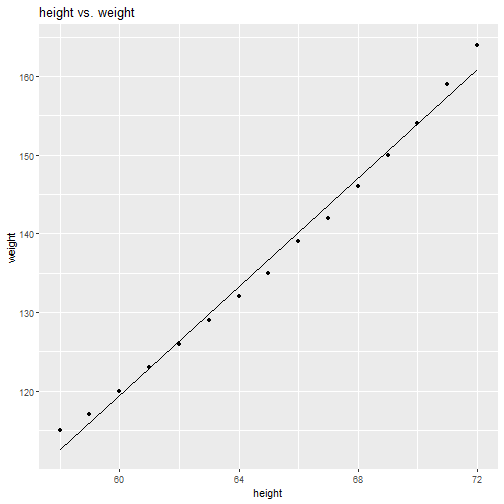

# ggLinearModel

`ggLinearModel` is a package designed to create easy linear model visualizations in one simple step. Using the `ggLinearModel` function you can create lots of different types of linear models, including models with:

- the same slope
- the same intercept
- polynomial predictors
- varying number of interaction effects
- confidence, and prediction, intervals, with the ability to change the confidence level
- interactive features to show the equation for LSRL or information about a specific data point.

# Old vs. New
Although creating plots in R is super easy thanks to the creation of `ggplot()`, adding multiple different items to a plot can be complex, and require lots of code. In this section you can view the differences in code required to create different types of linear models and then visualize them.

### The full model
This model is the easiest to code in `ggplot()`, the most important part is the `geom_smooth(method = lm, ...)` which insures that graph adds the least squares regression lines for each category.
Using `ggLinearModel()` we just input our data table, x variable, y variable, and categorical variable to create the same graph in much less code.

```r
ggplot(data = iris, aes(x = Sepal.Length, y = Sepal.Width, col = Species)) + 
    geom_point() +
    geom_smooth(method = lm, se = FALSE)
```


```r
ggLinearModel(iris, Sepal.Length, Sepal.Width, Species)
```


### Same slope model
Now let's assume that you want to create a visualization that shows the regression estimates as lines with the same slope, ergo, when there no interaction effect involved. In `ggplot()` we have no easy way to do this. We must first create model, and instead of one `geom_smooth()` we must add a new `geom_abline()` for each level in the dataset, with each `geom_abline()` having different inputs for the intercept parameter. This is going to get messy quickly with lots of levels in your categorical variable. Using `ggLinearModel(..., same_slope = TRUE)` will get the same process done in much less code, and prevents you from making any mistakes when creating each individual `geom_abline()`

```r
model <- lm(Sepal.Width ~ Sepal.Length + Species, data = iris)
m <- model$coefficients[2] #slope of model
b <- model$coefficients[1] #setosa intercept
ggplot() + 
    geom_point(data = iris, aes(x = Sepal.Length, y = Sepal.Width, col = Species)) +
    geom_abline(aes(slope = m,
                intercept = b, 
                color = 'setosa')) +
    geom_abline(aes(slope = m, 
                intercept = b + model$coefficients[3], 
                color = 'versicolor')) +
    geom_abline(aes(slope = m, 
                intercept = b + model$coefficients[4], 
                color = 'virginica'))
```


```r
ggLinearModel(iris, Sepal.Length, Sepal.Width, Species, same_slope = TRUE)
```


### Same intercept model
Creating a graph which showcases the data sharing a intercept, but differing slopes, as seen in model with an interaction effect, but not a categorical effect, is complex in `ggplot()`, but easy in `ggLinearModel()` by just adding the `ggLinearModel(..., same_intercept = TRUE)` parameter.

```r
model <- lm(Sepal.Width ~ Sepal.Length + Sepal.Length:Species, data = iris)
b <- model$coefficients[1] #intercept of model
m <- model$coefficients[2] #slope
ggplot(data = iris, aes(x = Sepal.Length, y = Sepal.Width, col = Species)) + 
    geom_point() +
    geom_abline(aes(intercept = b,
                    slope = m,
                    color = 'setosa')) +
    geom_abline(aes(slope = m + model$coefficients[3], 
                    intercept = b,
                    color = 'versicolor')) +
    geom_abline(aes(slope = m + model$coefficients[4], 
                    intercept = b,
                    col = 'virginica'))
```


```r
ggLinearModel(iris, Sepal.Length, Sepal.Width, Species, same_intercept = TRUE)
```


### Polynomial model
Using `ggLinearModel` you can make models with any number of polynomial predictors, and with any number of interactions. Just add the poly parameter to 

```r
mpg$year <- as.factor(as.character(mpg$year))
model <- lm(hwy ~ displ + I(displ^2) + displ:year + I(displ^2):year, data = mpg)
ggplot(data = mpg, aes(x = displ, y = hwy, col = year)) +
    geom_point() +
    stat_function(fun=function(x) 
        model$coefficients[1] + model$coefficients[2]*x + 
            model$coefficients[3]*x^2, 
        aes(col = '1999')) + 
    stat_function(fun=function(x) 
        model$coefficients[1] + model$coefficients[2]*x + 
            I(x^2)*model$coefficients[5]+model$coefficients[3]*x^2 + model$coefficients[4]*x, 
        aes(col = '2008'))
```


```r
ggLinearModel(mpg, displ, hwy, year, poly = 2)
```


### Polynomial model with fewer interactions
If it doesn't make sense to include a model with as many interaction effects as polynomial predictors you can modify this in the `ggLinearModel` function. As a default when using the polynomial parameter in the `ggLinearModel` function automatically assigns the number of interaction effects to be equal to the number of polynomial predictors. You can change this by setting the interactions parameter to a different number than the what you set poly at. Of course the interactions parameter will not work unless you set the poly parameter.

```r
model <- lm(hwy ~ displ + I(displ^2) + displ:year, data = mpg)
ggplot(data = mpg, aes(x = displ, y = hwy, col = year)) +
    geom_point() +
    stat_function(fun=function(x) 
        model$coefficients[1] + model$coefficients[2]*x + 
            model$coefficients[3]*x^2, 
        aes(col = '1999')) + 
    stat_function(fun=function(x) 
        model$coefficients[1] + model$coefficients[2]*x + 
            I(x^2)*model$coefficients[3] + model$coefficients[4]*x, 
        aes(col = '2008'))
```


```r
ggLinearModel(mpg, displ, hwy, year, poly = 2, interactions = 1)
```


# Added Features

### confidence interval and prediction interval
Setting ci or pi to TRUE will add a confidence interval, and setting level to a number between 0 and 1 will change the confidence level of the interval. 

```r
ggLinearModel(CO2, conc, uptake, Type, ci = T)
```


```r
ggLinearModel(CO2, conc, uptake, Type, pi = T)
```


```r
ggLinearModel(CO2, conc, uptake, Type, pi = T, level = .5)
```


### Label name changing
Although `ggLinearModel()` will return a `ggplot` object you can still add a title, x-axis label, y-axis label, and legend title within `ggLinearModel()`.

```r
ggLinearModel(mtcars, wt, mpg, cyl, 
              title = "The Affect of a car's weight on the MPG", xlabel = 'Weight (1,000 
lbs)', 
              ylabel = 'Miles per Gallon', legendTitle = 'Number of Cylinders in engine')
```


### Models and their coefficients
`ggLinearModel(..., coefficients = TRUE)` will print the coefficients used to create the models and LSRL. However, if you want to get the whole model back use `ggLinearModel(..., model = TRUE)`.

```r
ggLinearModel(iris, Sepal.Length, Sepal.Width, Species, coefficients = T)
#>                    (Intercept)                   Sepal.Length 
#>                     -0.5694327                      0.7985283 
#>              Speciesversicolor               Speciesvirginica 
#>                      1.4415786                      2.0157381 
#> Sepal.Length:Speciesversicolor  Sepal.Length:Speciesvirginica 
#>                     -0.4788090                     -0.5666378
```


```r
ggLinearModel(iris, Sepal.Length, Sepal.Width, Species, model = T)
#> $model
#> 
#> Call:
#> lm(formula = yvar ~ xvar * catvar, data = data)
#> 
#> Coefficients:
#>                    (Intercept)                    Sepal.Length  
#>                        -0.5694                          0.7985  
#>              Speciesversicolor                Speciesvirginica  
#>                         1.4416                          2.0157  
#> Sepal.Length:Speciesversicolor   Sepal.Length:Speciesvirginica  
#>                        -0.4788                         -0.5666  
#> 
#> 
#> $plot
```


### No categorical variable?
No problem. `ggLinearModel()` works without giving a categorical variable and any parameters you want.

```r
ggLinearModel(women, height, weight)
```



### Interactive and plotly features
You can create plots that will give the user more information about a data point when the point is hovered over. Hovering over a line in the interactive plots will give the equation for the line. You can access these features using this example code `ggLinearModel(iris, Sepal.Length, Sepal.Width, Species, interactive = TRUE)`.
If you prefer plotly style plots to the ggplots from above you can add the plotly parameter and set it to TRUE as such, `ggLinearModel(..., plotly = TRUE)` This will modify the ggplot object and turn it into a plotly object. 
